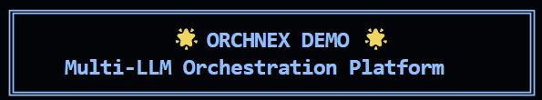
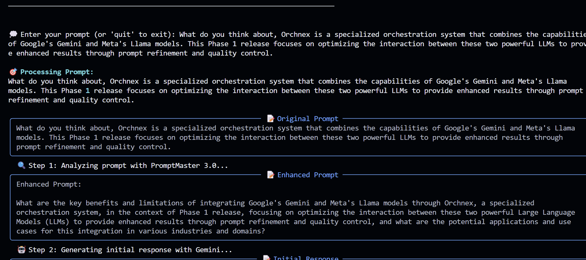
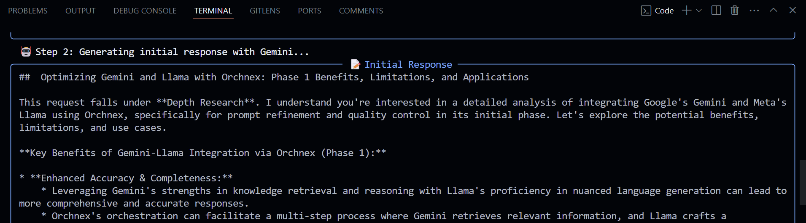
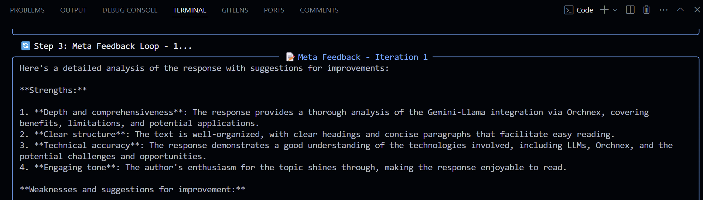
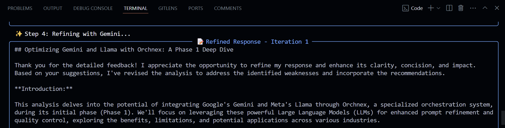

# Orchnex: Gemini-Llama Orchestration System

<p align="center">
  
</p>

## Overview

Orchnex is a specialized orchestration system that combines the capabilities of Google's Gemini and Meta's Llama models. This Phase 1 release focuses on optimizing the interaction between these two powerful LLMs to provide enhanced results through prompt refinement and quality control.

<details>
    <summary>🔽 Orchnex Output</summary>

|System Initialization|Enhanced Prompt|
|--|--|
|Inital Response|Meta Feedback-1|
|Refined Response-1|Meta Feedback-2|
|Refined Response-2|Final Result|

</details>

## How to Setup

### Requirements 
- Google AI Python SDK

Setup
```bash
pip install google-generativeai
```

- Open AI

Setup
```bash
pip install openai
```

### Setup API keys { for now we, are limited to GEMINI and LLAMA API (NIM API) }

#### Steps for GEMINI API

1. GEMINI API = https://aistudio.google.com/app/apikey
2. Login through your google account
3. Create an API key
4. Select your project
5. Your api key will be create, it will look like : AIzaSxxxxxxxxxxh09xxLwCA
6. Store it safe

#### Steps for LLAMA API using NVIDIA NIM API

1. NIM API = https://build.nvidia.com/explore/discover
2. Login or create an NVIDIA account to access
3. Here, you can also explore other various models, but for our project its llama-3_1-8b-instruct
4. llama-3_1-8b-instruct = https://build.nvidia.com/meta/llama-3_1-8b-instruct
5. Click Build with this NIM
6. Generate an API key, it will look like this : nvapi-056fxxxxxxxxxheZxxxxxxxxxxxxxxxxxxxxbg0
7. Store it safe

### Clone this repo.

1. Choose a directory to clone
2. Open Terminal, and
    ```bash
    cd (your_directory)
    ```
3. Clone the repository
    ```bash
    git clone https://github.com/harshalmore31/orchnex.git
    ```
4. Open in Code Editor, eg. VS Code
5. Open the requirements.text and download the necessary requirements and dependencies
6. To test in Action Run, [.src/main.py](src/main.py)
    ```bash
    python src/main.py
    ```
7. Enter the saved API keys
8. Enter the prompt, go throught the whole flow, to view the interaction within two LLM

## Orchnex In Action


#### Orchnex Architecture
*flowchart of orchnex of gemini and llama*

## Key Features

- 🤖 **Dual-LLM Orchestration**: Seamless coordination between Gemini and Llama
- 🔄 **PromptMaster Enhancement**: Automatic prompt optimization using Llama
- ✨ **Phoenix Response Generation**: High-quality responses via Gemini
- 📊 **Quality Control Loop**: Automated refinement process
- 📈 **Performance Metrics**: Detailed orchestration insights

## Quick Start

```python
from orchnex import MultiLLMOrchestrator, LLMConfig

# Initialize with your API keys
config = LLMConfig(
    gemini_api_key="your_gemini_key",
    nvidia_api_key="your_nvidia_key"  # For Llama access
)

# Create orchestrator
orchestrator = MultiLLMOrchestrator(config)

# Process input with visualization
result = orchestrator.process_input(
    "Explain quantum computing",
    verbose=True
)
print(result)
```


## How It Works

1. **PromptMaster (Llama)**
   - Analyzes and enhances input prompts
   - Provides structured enhancement strategies

2. **Phoenix (Gemini)**
   - Generates high-quality initial responses
   - Refines based on feedback

3. **Quality Control Loop**
   - Llama analyzes response quality
   - Gemini implements refinements
   - Process continues until quality threshold met

## Current Limitations

- Currently supports only Gemini and Llama models
- Requires both API keys to function
- Optimized for specific use cases

## Future Development

Phase 2 will include:
- Support for additional LLM providers
- Flexible provider interface
- Custom orchestration patterns
- Advanced configuration options

## Documentation

Visit our [documentation](https://orchnex.readthedocs.io) for:
- Detailed setup instructions
- API reference
- Usage examples
- Performance optimization guides


